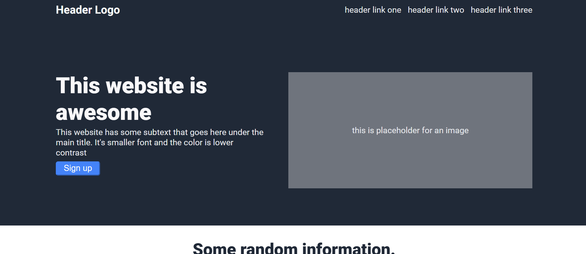

# intro-webpage

A simple responsive landing page built using HTML and CSS. Layout design credit goes to [The Odin Project](https://www.theodinproject.com/).

## Live Demo

[Live Site](https://a-azzamx.github.io/intro-webpage/) 

## Screenshot



## Features

- Header with logo and nav links
- Hero section with heading, text, and a sign up button
- Info section with a 4-column grid
- Quote/testimonial section
- Call to action banner
- Footer

## Built With

- HTML5
- CSS3 (Flexbox)

## Repository Structure

```
├── index.html
├── style.css
├── screenshot.png
└── README.md
```

## How to Run

1. Clone this repo
2. Open `index.html` in your browser

## Notes

Made this while practicing Flexbox and basic CSS styling.